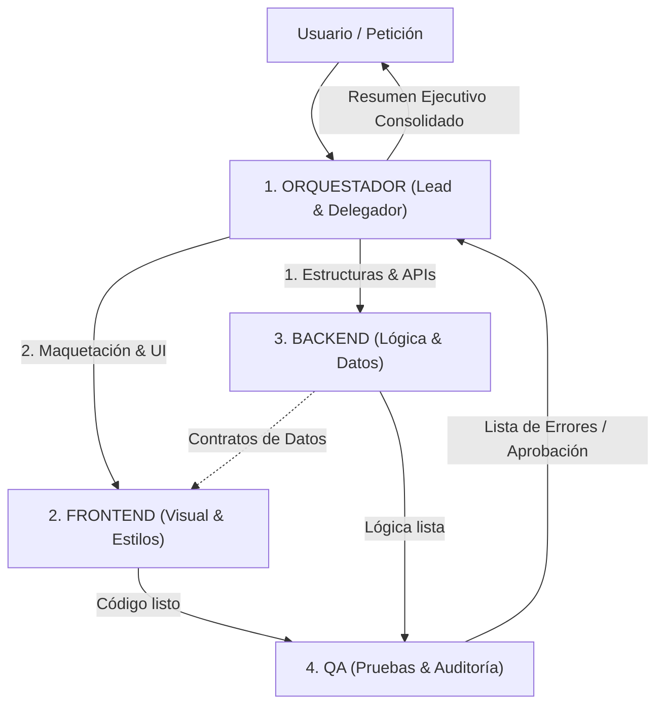

# Habilidad: Agentes Personalizados (Custom Agents) en Antigravity

Esta habilidad documenta y estandariza la creación, configuración, almacenamiento y orquestación de **agentes personalizados y especializados** a nivel de proyecto dentro del ecosistema Antigravity.

---

## 1. Arquitectura del Equipo de Desarrollo Web

Para proyectos de desarrollo web sin código y flujos de trabajo profesionales, el proyecto cuenta con un equipo de 4 agentes especializados con responsabilidades estrictamente delimitadas:



### Roles y Responsabilidades:

| Agente | Nombre en Archivo | Misión Principal | Regla Estricta | Herramientas Clave |
| :--- | :--- | :--- | :--- | :--- |
| **Orquestador** | `orquestador` | Recibe la petición, la descompone en tareas, decide el orden, delega y valida. Al finalizar, resume el trabajo de todos. | **NO programa código**: solo planifica, delega y valida. | `invoke_subagent`, `send_message`, `manage_subagents`, `view_file` |
| **Frontend** | `frontend` | Toda la interfaz y la parte visual: maquetación, estilos CSS/Tailwind, componentes React/HTML, diseño responsive y modo claro/oscuro. | **NO toca la lógica de datos**, persistencia ni APIs. | `view_file`, `replace_file_content`, `write_to_file` |
| **Backend** | `backend` | La lógica invisible: estructura y modelos de datos, persistencia en base de datos (Supabase/PostgreSQL/localStorage), validaciones de negocio y sincronización. | **NO toca el diseño visual**, CSS ni estilos. | `view_file`, `replace_file_content`, `write_to_file`, `run_command` |
| **QA** | `qa` | Prueba lo que hacen Frontend y Backend, ejecuta builds y linters, prueba cada funcionalidad, busca errores y devuelve la lista de fallos al Orquestador. | **NO implementa correcciones**: solo prueba y reporta. | `run_command`, `view_file`, `grep_search`, `read_url_content` |

---

## 2. Ubicación de Archivos en el Proyecto

Todos los agentes se almacenan exclusivamente a nivel local del proyecto dentro del directorio `.agents/` en la raíz del repositorio:

```text
c:\Users\RYESA\Documents\sindy luxury\
└── .agents/
    ├── skills/
    │   └── agentes-personalizados/
    │       ├── SKILL.md                     # Este documento maestro
    │       ├── references/
    │       │   └── agent_schema.md          # Especificación formal JSON Schema
    │       └── templates/
    │           └── agent_template.json      # Plantilla JSON base
    └── agents/
        ├── orquestador/
        │   └── agent.json                   # Definición del Orquestador
        ├── frontend/
        │   └── agent.json                   # Definición del Frontend UI/UX
        ├── backend/
        │   └── agent.json                   # Definición del Backend & Datos
        ├── qa/
        │   └── agent.json                   # Definición de QA & Pruebas
        └── catalog_curator/
            └── agent.json                   # Auditor de catálogo y coherencia de productos
```

> [!IMPORTANT]
> **Aislamiento de Proyecto:** Al residir en `.agents/` dentro del repositorio del proyecto, estos agentes quedan versionados por Git, son portables y no interfieren con la configuración global del sistema (`~/.gemini/config/`).

---

## 3. Esquema y Formato de `agent.json`

Cada agente se define mediante un archivo `agent.json` con la siguiente estructura:

```json
{
  "name": "identificador_unico",
  "description": "Descripción clara del rol y cuándo debe invocarse.",
  "hidden": false,
  "config": {
    "customAgent": {
      "systemPromptSections": [
        {
          "title": "Título de Instrucciones",
          "content": "Instrucciones de comportamiento, directivas y restricciones."
        }
      ],
      "toolNames": [
        "send_message",
        "view_file",
        "replace_file_content",
        "write_to_file",
        "run_command"
      ],
      "systemPromptConfig": {
        "includeSections": [
          "user_information",
          "mcp_servers",
          "skills",
          "subagent_reminder",
          "messaging",
          "artifacts",
          "user_rules"
        ]
      }
    }
  }
}
```

---

## 4. Protocolo de Ejecución del Orquestador

Cuando el usuario envía una solicitud, el **Orquestador** sigue este procedimiento riguroso:

### Paso 1: Análisis y División de Tareas
El Orquestador analiza la necesidad del usuario y la divide en tareas atómicas para Backend y Frontend.
* *Ejemplo:* "Añadir un sistema de cupones de descuento".
  * **Tarea Backend:** Definir interfaz `Coupon`, lista de cupones válidos y función de validación `applyCoupon(code, subtotal)`.
  * **Tarea Frontend:** Diseñar el input de cupón en el drawer del carrito, badge de descuento aplicado y animación de feedback.

### Paso 2: Delegación Secuencial
El Orquestador invoca a los subagentes vía `invoke_subagent`:
1. Primero invoca a **`backend`** para que cree los modelos de datos y funciones de negocio.
2. Una vez que Backend termina, invoca a **`frontend`** pasándole el contrato de datos para que construya la UI.

### Paso 3: Control de Calidad con QA
El Orquestador invoca a **`qa`** para ejecutar:
- `npm.cmd run build` (verificación de tipos y compilación).
- Comprobación funcional del flujo.
- Detección de posibles inconsistencias (ej. tallas en cremas, precios negativos o enlaces rotos).

### Paso 4: Bucle de Corrección (Feedback Loop)
Si QA reporta fallos, el Orquestador:
1. Lee la lista de errores.
2. Reenvía los fallos específicos a **`frontend`** o a **`backend`** vía `send_message`.
3. Vuelve a pedir validación a **`qa`** hasta que no queden errores.

### Paso 5: Resumen Ejecutivo al Usuario
El Orquestador presenta un informe consolidado al usuario:
- Qué planificó.
- Qué implementó Backend.
- Qué diseñó Frontend.
- Qué validó QA (con confirmación del build).
- Enlace al resultado final.

---

## 5. Ejemplos de Invocación con `invoke_subagent`

### Invocar al Orquestador:
```json
{
  "Subagents": [
    {
      "TypeName": "orquestador",
      "Role": "Lead Project Orchestrator",
      "Prompt": "Coordina al equipo (Backend, Frontend y QA) para implementar un filtro por rangos de precio en el catálogo de Sindy Luxury.",
      "Model": "inherit",
      "Workspace": "inherit"
    }
  ]
}
```

### Invocar a Frontend:
```json
{
  "Subagents": [
    {
      "TypeName": "frontend",
      "Role": "UI Designer & Developer",
      "Prompt": "Crea el componente visual PriceRangeSlider.tsx con estilo luxury en tonos dorados y diseño responsive para móviles. No toques la lógica de base de datos.",
      "Model": "inherit",
      "Workspace": "inherit"
    }
  ]
}
```

### Invocar a Backend:
```json
{
  "Subagents": [
    {
      "TypeName": "backend",
      "Role": "Data & Logic Architect",
      "Prompt": "Implementa la función de filtrado por rango de precio filterProductsByPriceRange(products, min, max) con validación de límites en src/lib/filters.ts.",
      "Model": "inherit",
      "Workspace": "inherit"
    }
  ]
}
```

### Invocar a QA:
```json
{
  "Subagents": [
    {
      "TypeName": "qa",
      "Role": "Quality Assurance Tester",
      "Prompt": "Ejecuta npm.cmd run build, prueba el funcionamiento del filtro de precios con valores extremos y devuelve la lista de errores encontrados si alguno falla.",
      "Model": "inherit",
      "Workspace": "inherit"
    }
  ]
}
```
